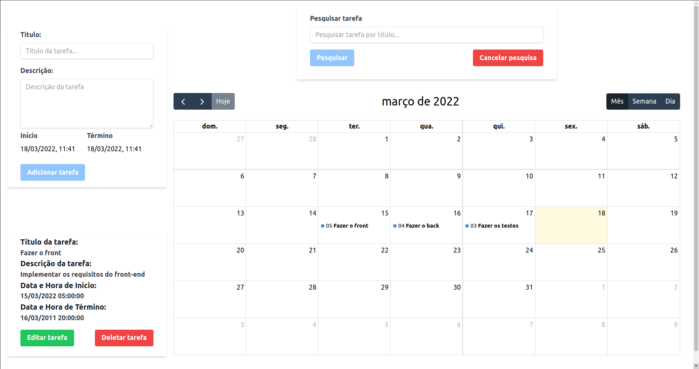
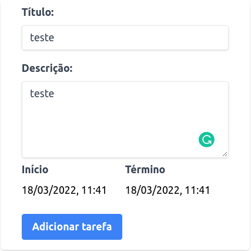
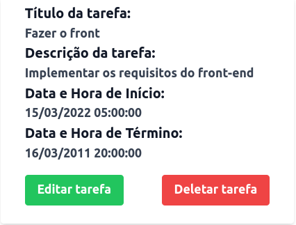
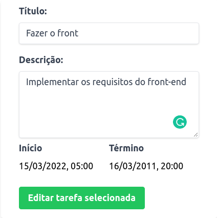
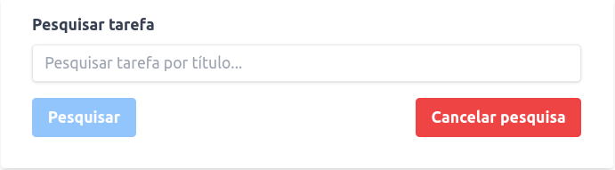

# Task Calendar - Desafio Full stack [Diel Energia](https://dielenergia.com/)

<div>
  
</div>

> Task Calendar é uma aplicação full stack onde você pode criar, editar e deletar tarefas e acompanhá-las em um calendário.

>Esta aplicação foi desenvolvida como desafio técnico da Diel Energia para o cargo de Desenvolvedor Fullstack Junior.

>A [Diel Energia](https://dielenergia.com/) resolve problemas práticos de gestão da refrigeração, fazendo com que empresas deixem de pagar desnecessariamente por consumo de energia e manutenção excessivos. Com uma equipe multidisciplinar e muita tecnologia, a Diel está construindo a nova era da gestão de refrigeração e da indústria do frio.

## 🛠️ Tecnologias e Ferramentas utilizadas
#### Front-end
* React
* React Hooks
* Context API
* Javascript
* Tailwind CSS
* [FullCalendar](https://fullcalendar.io/)
* [React-Datepicker](https://reactdatepicker.com/)
* Axios

#### Back-end
* Node.js
* Express.js
* Sequelize.js
* Mysql2
* Dotenv
* Express Async Errors
* [Joi](https://joi.dev/)
* Mocha
* Chai
* Sinon
* Nyc
* Nodemon

## 💻 Pré-requisitos

Esta aplicação utiliza o [Docker](https://www.docker.com/) e o [Docker Compose](https://docs.docker.com/compose/install/) para iniciá-la, portanto certifique-se que ambas as ferramentas estão instaladas corretamente em seu computador.

## 🚀 Clonando o projeto

Abra seu terminal e digite os seguintes comandos:
```
git clone https://github.com/Matta-012/task-calendar.git

cd task-calendar
```
## 🚀 Iniciando a Aplicação
Com o projeto clonado em sua máquina e dentro do diretório `task-calendar`, execute o seguinte comando do docker compose:

```
docker-compose up
```
Aguarde a instalação até que a mensagem `Conectado na porta 3001` apareça em seu terminal.

Abra seu navegador do `Google Chrome` e digite o seguinte link:

[http://localhost:3000/](http://localhost:3000/)

Aguarde até a aplicação iniciar.

#### Testando a aplicação

O back-end desta aplicação possui testes unitários dos controladores. **Para executá-los e checar a cobertura de testes, siga as seguintes instruções:**

Navegue até o diretório `server`:
```
cd /server
```
Execute os testes:
```
npm test
```
## Utilizando a Aplicação

Assim que a aplicação iniciar, automaticamente serão carregadas na tela algumas tarefas já preenchidas previamente no banco de dados.

#### Criando uma nova tarefa

<div>
  
</div>

Para criar uma tarefa, basta adicionar um título (obrigatório), uma descrição, a data e hora inicial (obrigatório), a data e hora de término e clicar no botão de adicionar tarefa.

#### Editando ou Deletando uma tarefa

<div>
  
</div>

Para deletar uma tarefa, basta clicar em uma tarefa no calendário que uma nova janela aparecerá em sua tela e depois basta clicar no botão `Deletar tarefa`.

Para editar uma tarefa, basta clicar em uma tarefa no calendário que uma nova janela aparecerá em sua tela e depois basta clicar no botão `Editar tarefa`.

As informações da sua tarefa serão carregadas no formulário de alteração e, após fazer as alterações desejadas, basta clicar no botão `Editar tarefa selecionada`.

<div>
  
</div>

#### Pesquisando tarefas por título

<div>
  
</div>

Para pesquisar por uma tarefa pelo seu título, faça uma busca no campo indicado com os termos desejados e clique no botão `Pesquisar`. Caso alguma tarefa seja encontrada, apenas as tarefas que possuem o termo pesquisado em seu título serão exibidas no calendário.

Para cancelar a pesquisa, clique no botão `Cancelar pesquisa` para que todas as tarefas sejam atualizadas e listadas novamento no calendário.

## Endpoints da API
Esta API possui os seguintes endpoint:

| Method | Description |
|---|---|
| `GET - localhost:3001/tasks` | Retorna todas as tarefas cadastradas no Banco de Dados. |
| `GET - localhost:3001/tasks/search` | Retorna todas as tarefas que satisfaçam o termo pesquisado. |
| `POST - localhost:3001/tasks` | Cria uma nova tarefa. |
| `PUT - localhost:3001/tasks/:id` | Atualiza uma tarefa existente com novas informações. |
| `DELETE - localhost:3001/tasks/:id` | Deleta uma tarefa. |

## Utilizando a API
Os exemplos a seguir utilizam o [Isomnia](https://insomnia.rest/) para fazer as requisições, porém você pode utilizar outros meios, se preferir.

### Tarefas (`/tasks`)
Possui todas as informações pertinentes às tarefas cadastradas no banco de dados.

#### Listar todas as tarefas [GET `/tasks`]
+ Resposta 200 OK (application/json)

          [
            {
              "id": 1,
              "title": "Fazer o front",
              "description": "Implementar os requisitos do front-end",
              "startDate": "2022-03-15T08:00:00.000Z",
              "endDate": "2011-03-16T23:00:00.000Z"
            },
            {
              "id": 2,
              "title": "Fazer o back",
              "description": "Implementar os requisitos do back-end",
              "startDate": "2022-03-16T07:00:00.000Z",
              "endDate": "2011-03-17T23:00:00.000Z"
            },
            {
              "id": 3,
              "title": "Fazer os testes",
              "description": "Implementar os testes do back-end",
              "startDate": "2022-03-17T06:00:00.000Z",
              "endDate": "2011-03-18T14:30:00.000Z"
            }
          ]
          
#### Criar uma nova tarefa [POST `/tasks`]
+ Atributos (object)
  + title: título da tarefa (precisa ser uma string, campo obrigatório e o tamanho mínimo é de 3 caracteres)
  + description: descrição da tarefa (precisa ser uma string)
  + startDate: data e hora de início da tarefa (precisa ser uma data válida e não pode ser nula)
  + endDate: data e hora de término da tarefa (precisa ser uma data, não é um campo obrigatório, não pode ser menor que a data inicial)

+ Requisição (application/json)
  + Body

          {
            "title": "test",
            "description": "testando",
            "startDate": "2022-03-17T06:00:00.000Z",
            "endDate": "2022-03-18T14:30:00.000Z"
          }
          
+ Resposta 201 Created (application/json)

          {
            "id": 4,
            "title": "test",
            "description": "testando",
            "startDate": "2022-03-17T06:00:00.000Z",
            "endDate": "2022-03-18T14:30:00.000Z"
          }
          
+ Resposta 400 Bad Request (application/json)

          {
            "message": "\"title\" is required"
          }
          
+ Resposta 422 Unprocessable Entity (application/json)

          {
            "message": "\"title\" must be a string"
          }
          
+ Resposta 422 Unprocessable Entity (application/json)

          {
            "message": "\"title\" must be at least 3 characters long"
          }
          
+ Resposta 400 Bad Request (application/json)

          {
            "message": "\"startDate\" is required"
          }
          
+ Resposta 422 Unprocessable Entity (application/json)

          {
            "message": "\"startDate\" must be a valid date"
          }
          
+ Resposta 422 Unprocessable Entity (application/json)

          {
            "message": "\"endDate\" must be greater than start date"
          }

#### Listar todos os produtos por parâmetro de pesquisa [GET `/tasks/search?q={testes}`]   
+ Resposta 200 OK (application/json)

          [
            {
              "id": 3,
              "title": "Fazer os testes",
              "description": "Implementar os testes do back-end",
              "startDate": "2022-03-17T06:00:00.000Z",
              "endDate": "2011-03-18T14:30:00.000Z"
            }
          ]

#### Atualizar uma tarefa [PUT `/tasks/{id}`]
+ Atributos (object)
  + title: título da tarefa (precisa ser uma string, campo obrigatório e o tamanho mínimo é de 3 caracteres)
  + description: descrição da tarefa (precisa ser uma string)
  + startDate: data e hora de início da tarefa (precisa ser uma data válida e não pode ser nula)
  + endDate: data e hora de término da tarefa (precisa ser uma data, não é um campo obrigatório, não pode ser menor que a data inicial)

+ Requisição (application/json)
  + Body

          {
            "title": "test",
            "description": "testando",
            "startDate": "2022-03-17T06:00:00.000Z",
            "endDate": "2022-03-18T14:30:00.000Z"
          }

+ Response 200 OK (application/json)

          {
            "id": 4,
            "title": "test",
            "description": "testando",
            "startDate": "2022-03-17T06:00:00.000Z",
            "endDate": "2022-03-18T14:30:00.000Z"
          }

+ Resposta 404 Not Found (application/json)

          {
            "message": "Task not found!"
          }

+ Resposta 400 Bad Request (application/json)

          {
            "message": "\"title\" is required"
          }
          
+ Resposta 422 Unprocessable Entity (application/json)

          {
            "message": "\"title\" must be a string"
          }
          
+ Resposta 422 Unprocessable Entity (application/json)

          {
            "message": "\"title\" must be at least 3 characters long"
          }
          
+ Resposta 400 Bad Request (application/json)

          {
            "message": "\"startDate\" is required"
          }
          
+ Resposta 422 Unprocessable Entity (application/json)

          {
            "message": "\"startDate\" must be a valid date"
          }
          
+ Resposta 422 Unprocessable Entity (application/json)

          {
            "message": "\"endDate\" must be greater than start date"
          }

#### Deletar uma tarefa por ID [DELETE `/tasks/{id}`]   
+ Resposta 204 No Content (application/json)

+ Resposta 404 Not Found (application/json)

          {
            "message": "Task not found!"
          }

## Autor

<table>
  <tr>
    <td align="center">
      <a href="https://www.linkedin.com/in/joao-marco-matta/" target="_blank" rel="noopener noreferrer">
        <br>
        <sub>
          <b>João Marco Matta</b>
        </sub>
      </a>
    </td>
  </tr>
</table>

## Licença
>Você pode conferir todas as informações sobre a licença [aqui](https://github.com/Matta-012/store-manager/blob/main/LICENSE)

Este projeto está licenciado sob os termos da licença **MIT**.
