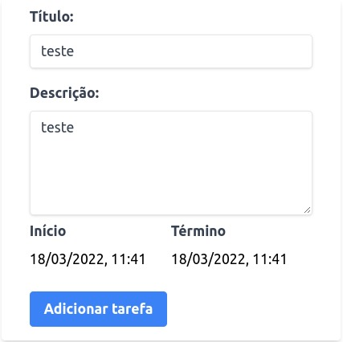
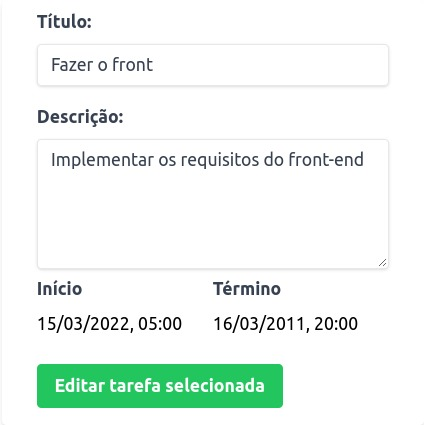

# Task Calendar

<div>
  
</div>

> Task Calendar is a full stack application where you can create, edit and delete tasks and keep track of them on a calendar.

## 🛠️ Technologies and Tools used
#### Front-end
* React
* React Hooks
* Context API
* Javascript
* Tailwind CSS
* [FullCalendar](https://fullcalendar.io/)
* [React-Datepicker](https://reactdatepicker.com/)
* Axios

#### Back-end
* Node.js
* Express.js
* Sequelize.js
* Mysql2
* Dotenv
* Express Async Errors
* [Joi](https://joi.dev/)
* Mocha
* Chai
* Sinon
* Nyc
* Nodemon

## 💻 Prerequisites

This application uses [Docker](https://www.docker.com/get-started/) and [Docker Compose](https://docs.docker.com/compose/install/) to start it, so make sure that both tools are installed correctly on your computer.

## 🚀 Cloning the Project


Open your terminal and type the following commands:
```
git clone https://github.com/Matta-012/task-calendar.git

cd task-calendar
```
## 🚀 Starting the Application
With the project cloned on your machine and inside the `task-calendar` directory, run the following docker compose command:

```
docker-compose up
```
Wait for the installation until the message `Connected on port 3001` appears in your terminal.

Open your `Google Chrome` browser and enter the following link:

[http://localhost:3000/](http://localhost:3000/)

Wait until the application starts.

#### Testing the application

The back-end of this application has unit tests for the Controllers. **To run them and check test coverage, follow these instructions:**

Navigate to the `server` directory
```
cd /server
```
Install dependencies:
```
npm install
```
Start the tests
```
npm test
```
## Using the Application

As soon as the application starts, some tasks already filled in the database will automatically be loaded on the screen.

#### Creating a new task

<div>
  
</div>

To create a task, simply add a title (required), a description, the start date and time (required), the end date and time, and click the add task button.

#### Editing or Deleting a Task

<div>
  
</div>

To delete a task, just click on a task in the calendar and a new window will appear on your screen and then just click on the `Delete Task` button.

To edit a task, just click on a task in the calendar and a new window will appear on your screen and then just click on the `Edit Task` button.

Your task information will be loaded into the change form, and after making the desired changes, simply click on the `Edit selected task` button.

<div>
  
</div>

#### Searching tasks by title

<div>
  
</div>

To search for a task by its title, search in the field indicated with the desired terms and click on the `Search` button. If any tasks are found, only tasks that have the search term in their title will be displayed in the calendar.

To cancel the search, click the `Cancel Search` button so that all tasks are updated and re-listed in the calendar

## API Endpoints
This API has the following endpoints:

| Method | Description |
|---|---|
| `GET - localhost:3001/tasks` | Returns all tasks registered in the Database. |
| `GET - localhost:3001/tasks/search` | Returns all tasks that satisfy the search term. |
| `POST - localhost:3001/tasks` | Create a new task. |
| `PUT - localhost:3001/tasks/:id` | Updates an existing task with new information. |
| `DELETE - localhost:3001/tasks/:id` | Deletes a task. |

## Using the API
The following examples uses [Isomnia](https://insomnia.rest/) to make the requests, however you can use other tools, if you prefer.

### Tasks (`/tasks`)
It has all the information relevant to the tasks registered in the database.

#### List all tasks [GET `/tasks`]
+ Response 200 OK (application/json)

          [
            {
              "id": 1,
              "title": "Fazer o front",
              "description": "Implementar os requisitos do front-end",
              "startDate": "2022-03-15T08:00:00.000Z",
              "endDate": "2011-03-16T23:00:00.000Z"
            },
            {
              "id": 2,
              "title": "Fazer o back",
              "description": "Implementar os requisitos do back-end",
              "startDate": "2022-03-16T07:00:00.000Z",
              "endDate": "2011-03-17T23:00:00.000Z"
            },
            {
              "id": 3,
              "title": "Fazer os testes",
              "description": "Implementar os testes do back-end",
              "startDate": "2022-03-17T06:00:00.000Z",
              "endDate": "2011-03-18T14:30:00.000Z"
            }
          ]
          
#### Create a new task [POST `/tasks`]
+ Attributes (object)
  + title: task title (must be a string, required field and minimum length is 3 characters)
  + description: task description (must be a string)
  + startDate: task start date and time (must be a valid date and cannot be null)
  + endDate: task end date and time (must be a date, not a required field, cannot be less than the start date)

+ Request (application/json)
  + Body

          {
            "title": "test",
            "description": "testando",
            "startDate": "2022-03-17T06:00:00.000Z",
            "endDate": "2022-03-18T14:30:00.000Z"
          }
          
+ Response 201 Created (application/json)

          {
            "id": 4,
            "title": "test",
            "description": "testando",
            "startDate": "2022-03-17T06:00:00.000Z",
            "endDate": "2022-03-18T14:30:00.000Z"
          }
          
+ Response 400 Bad Request (application/json)

          {
            "message": "\"title\" is required"
          }
          
+ Response 422 Unprocessable Entity (application/json)

          {
            "message": "\"title\" must be a string"
          }
          
+ Response 422 Unprocessable Entity (application/json)

          {
            "message": "\"title\" must be at least 3 characters long"
          }
          
+ Response 400 Bad Request (application/json)

          {
            "message": "\"startDate\" is required"
          }
          
+ Response 422 Unprocessable Entity (application/json)

          {
            "message": "\"startDate\" must be a valid date"
          }
          
+ Response 422 Unprocessable Entity (application/json)

          {
            "message": "\"endDate\" must be greater than start date"
          }

#### List all products by search parameter [GET `/tasks/search?q={testes}`]   
+ Response 200 OK (application/json)

          [
            {
              "id": 3,
              "title": "Fazer os testes",
              "description": "Implementar os testes do back-end",
              "startDate": "2022-03-17T06:00:00.000Z",
              "endDate": "2011-03-18T14:30:00.000Z"
            }
          ]

#### Update a task [PUT `/tasks/{id}`]
+ Attributes (object)
  + title: task title (must be a string, required field and minimum length is 3 characters)
  + description: task description (must be a string)
  + startDate: task start date and time (must be a valid date and cannot be null)
  + endDate: task end date and time (must be a date, not a required field, cannot be less than the start date)

+ Request (application/json)
  + Body

          {
            "title": "test",
            "description": "testando",
            "startDate": "2022-03-17T06:00:00.000Z",
            "endDate": "2022-03-18T14:30:00.000Z"
          }

+ Response 200 OK (application/json)

          {
            "id": 4,
            "title": "test",
            "description": "testando",
            "startDate": "2022-03-17T06:00:00.000Z",
            "endDate": "2022-03-18T14:30:00.000Z"
          }

+ Response 404 Not Found (application/json)

          {
            "message": "Task not found!"
          }

+ Response 400 Bad Request (application/json)

          {
            "message": "\"title\" is required"
          }
          
+ Response 422 Unprocessable Entity (application/json)

          {
            "message": "\"title\" must be a string"
          }
          
+ Response 422 Unprocessable Entity (application/json)

          {
            "message": "\"title\" must be at least 3 characters long"
          }
          
+ Response 400 Bad Request (application/json)

          {
            "message": "\"startDate\" is required"
          }
          
+ Response 422 Unprocessable Entity (application/json)

          {
            "message": "\"startDate\" must be a valid date"
          }
          
+ Response 422 Unprocessable Entity (application/json)

          {
            "message": "\"endDate\" must be greater than start date"
          }

#### Delete a task by ID [DELETE `/tasks/{id}`]   
+ Response 204 No Content (application/json)

+ Response 404 Not Found (application/json)

          {
            "message": "Task not found!"
          }

## Author

<table>
  <tr>
    <td align="center">
      <a href="https://www.linkedin.com/in/joao-marco-matta/" target="_blank" rel="noopener noreferrer">
        <br>
        <sub>
          <b>João Marco Matta</b>
        </sub>
      </a>
    </td>
  </tr>
</table>

## License
>You can check all the information about the license [here](https://github.com/Matta-012/store-manager/blob/main/LICENSE)

This project is licensed under **MIT** terms.
